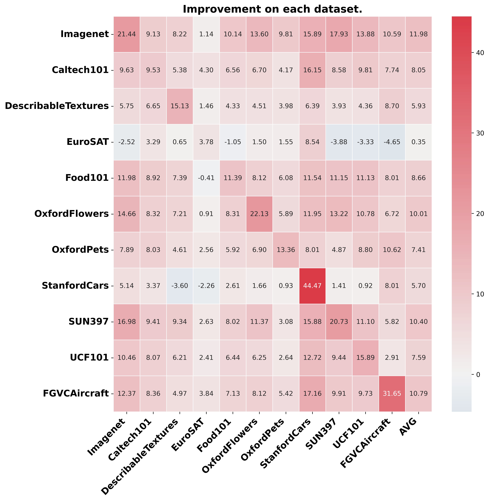
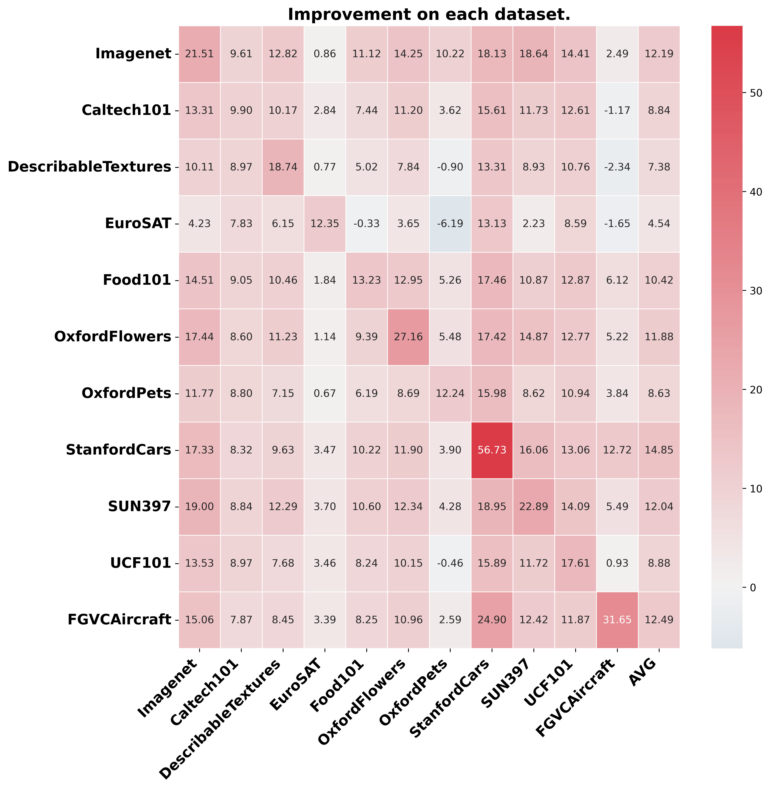

# Think or Not Think: A Study of Explicit Thinking in Rule-Based Visual Reinforcement Fine-Tuning
🗞️ News

**2025/09/18:** Excited to share that Think or Not Think has been accepted to NeurIPS 2025 as a Spotlight paper! See you in San Diego!

🔍 Overview

This paper investigates the role of explicit thinking process in rule-based reinforcement fine-tuning (RFT) for multi-modal large language models (MLLMs). We find several interesting findings of the thinking process of visual RFT.

[](http://arxiv.org/abs/2503.16188)

Key features:
  * **"Free-Lunch" Phenomenon:** Demonstrates that fine-tuning with CLS-RL on one dataset can improve performance on other, distinct datasets.

<table>
 <tr>
  <td width="50%">
   
  </td>
  <td width="50%">
   
  </td>
 </tr>
</table>

* **Visual perception tasks do not require thinking during RFT**
  
* **Models with limited capabilities struggle to generate high-quality CoT for RFT, making Thinking-based RFT less effective than No-Thinking-RL.**
  
* **There are inconsistencies between the answers in the thinking and answer tags for some responses of thinking-based RFT, which show lower accuracy than the overall accuracy**


## 🛠️ Installation

```bash
git clone https://github.com/minglllli/CLS-RL.git
cd CLS-RL
conda create -n cls-rl python=3.11
conda activate cls-rl
bash setup.sh
```

## Training
### Classification 

#### 1. CLS-RL Training
##### Fewshot training
Change the dataset name in fewshot.sh, then run
```bash
bash fewshot.sh
```
##### base-eo-new training
Change the dataset name in b2n.sh, then run
```bash
bash b2n.sh
```
#### 2. No-Thinking-RL Training
##### Fewshot training
Change the dataset name in fewshot_no-think.sh, then run
```bash
bash fewshot_no-think.sh
```
##### base-eo-new training
Change the dataset name in b2n_no-thinking.sh, then run
```bash
bash b2n_no-thinking.sh
```

#### 3. SFT Training
##### Fewshot training
Change the dataset name in fewshot_no-think.sh, then run
```bash
bash fewshot_no-think.sh
```
##### base-to-new training
Change the dataset name in b2n_no-thinking.sh, then run
```bash
bash b2n_no-thinking.sh
```

### SAT
Follow [VisualThinker-R1-Zero](https://github.com/turningpoint-ai/VisualThinker-R1-Zero) to prepare the dataset.
#### 1. VisualThinker-R1-Zero Training
```bash
bash run_sat.sh
```
#### 2. No-Thinking-RL Training
```bash
bash run_sat_no-think.sh
```
We provide the fine-tuned checkpoints below.

Fine-tuned model of thinking RL (VisualThinker-R1-Zero). [🤗 Model on Hugging Face](https://huggingface.co/afdsafas/Qwen2-VL-2B-Instruct-SAT-generation4)

Fine-tuned model of No-Thinking-RL. [🤗 Model on Hugging Face](https://huggingface.co/afdsafas/Qwen2-VL-2B-Instruct-SAT-generation4-Direct)
## Inference
We provide the [results](https://drive.google.com/drive/folders/1NXpGfWj1oazoK4SwzoDBqpV59Fjyi2od?usp=sharing) of classfication and CVBench for reference.
'direct' means no-thinking-rl. 
### Classification
Download the [test prompt](https://drive.google.com/drive/folders/1Quqh2H3TkqX91Rc2YUdnPXixzDDFf1dy?usp=sharing) to src/eval/prompts/. 
Follow [CoOp](https://github.com/KaiyangZhou/CoOp/blob/main/DATASETS.md) to download datasets and write the dataset path to src/eval/data_prefix.py.
#### Fewshot and Cross-Dataset
Change the MODEL_PATH in test_all_fewshot.sh and then run
```bash
bash test_all_fewshot.sh
```

#### Base-to-New
Change the MODEL_PATH in test_all_b2n.sh and then run
```bash
bash test_all_b2n.sh
```

### CVBench
```bash
bash test_cvbench.sh
```


## 📌 Open-source Plan

- [x] Release the fine-tuning and inference code.
- [x] Release the dataset.
- [x] Release the evaluation results.
- [x] Release the checkpoints.

## Acknowledgements

Our code is based on **R1-V**. We thank the authors of **R1-V** for their open-source contributions.  
🔗 [R1-V GitHub Repository](https://github.com/Deep-Agent/R1-V)

## Citation
```
@article{li2025think,
  title={Think or Not Think: A Study of Explicit Thinking in Rule-Based Visual Reinforcement Fine-Tuning},
  author={Li, Ming and Zhong, Jike and Zhao, Shitian and Lai, Yuxiang and Zhang, Kaipeng},
  journal={arXiv preprint arXiv:2503.16188},
  year={2025}
}
```
