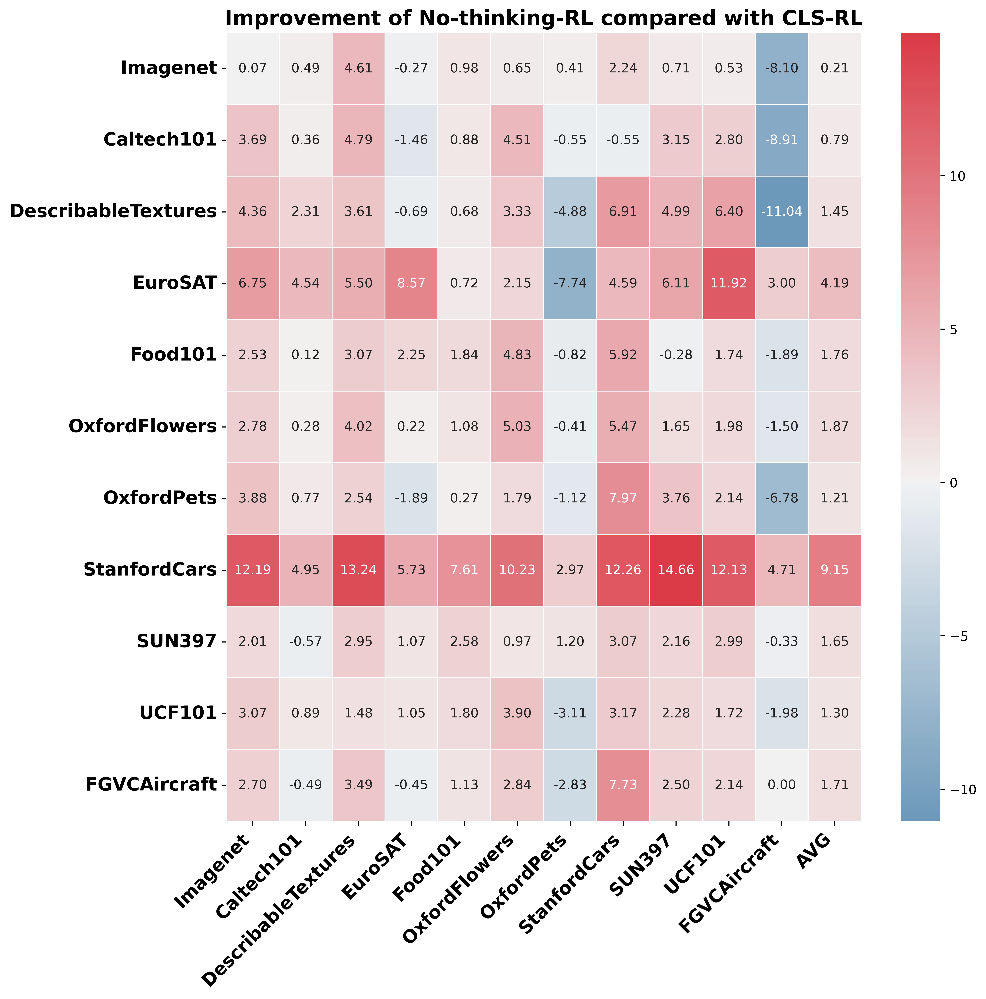

# CLS-RL: Image Classification with Rule-Based Reinforcement Learning
🔍 Overview

CLS-RL explores fine-tuning Multimodal Large Language Models (MLLMs) for image classification using rule-based reinforcement learning (RL). We introduce CLS-RL, which leverages verifiable signals (class names) for fine-tuning. CLS-RL demonstrates a "free-lunch" phenomenon, showing cross-dataset improvement, and we further introduce No-Thinking-RL, which optimizes performance by removing the thinking process during training.

[](http://arxiv.org/abs/2503.16188)

Key features of CLS-RL:
* **Rule-based Reinforcement Learning:** Fine-tunes MLLMs using verifiable reward losses instead of token-level losses, guiding models to explore diverse reasoning.
  
* **"Free-Lunch" Phenomenon:** Demonstrates that fine-tuning with CLS-RL on one dataset can improve performance on other, distinct datasets.

<table>
 <tr>
  <td width="50%">
   
  </td>
  <td width="50%">
   
  </td>
 </tr>
</table>

* **No-Thinking Variant:** Introduces No-Thinking-RL, which removes the thinking process during training, leading to improved performance and reduced training time.


* **No-Thinking-RL on CVBench:** We follow [VisualThinker-R1-Zero](https://github.com/turningpoint-ai/VisualThinker-R1-Zero) to fine-tune Qwen2-VL-2B-Instruct on SAT and then test on CVBench. We found that No-Thinking-RL surpasses VisualThinker-R1-Zero by 6% accuracy.
  
| Model                | Total Accuracy | Count Acc | Relation Acc | Depth Acc | Distance Acc |
|----------------------|---------------|-----------|--------------|-----------|--------------|
| No-Thinking-RL      | 0.7676        | 0.6967    | 0.8446       | 0.8067    | 0.7383       |
| VisualThinker-R1-Zero | 0.7036       | 0.6612    | 0.8338       | 0.6850    | 0.6367       |


## The code is coming soon!


## Acknowledgements

Our code is based on **R1-V**. We thank the authors of **R1-V** for their open-source contributions.  
🔗 [R1-V GitHub Repository](https://github.com/Deep-Agent/R1-V)


## Citation
```
@misc{li2025clsrl,
      title={CLS-RL: Image Classification with Rule-Based Reinforcement Learning}, 
      author={Ming Li, Shitian Zhao, Jike Zhong, Yuxiang Lai, Kaipeng Zhang},
      year={2025},
      eprint={2503.16188},
      archivePrefix={arXiv},
      primaryClass={cs.CV},
      url={http://arxiv.org/2503.16188}, 
}
```
